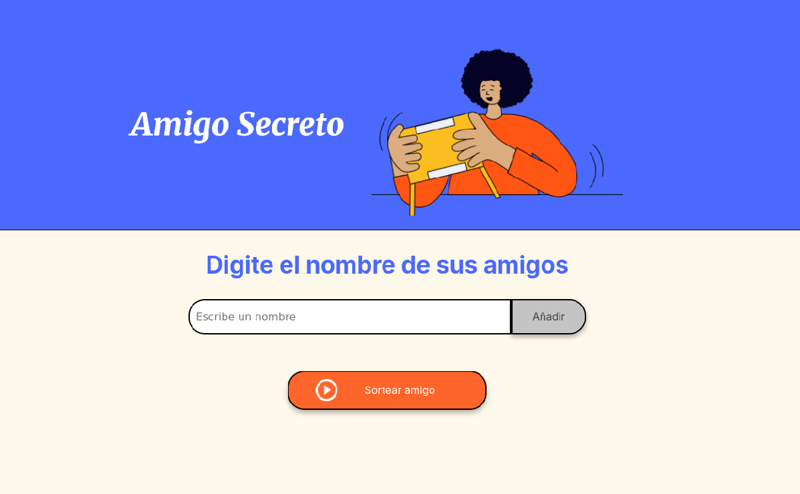
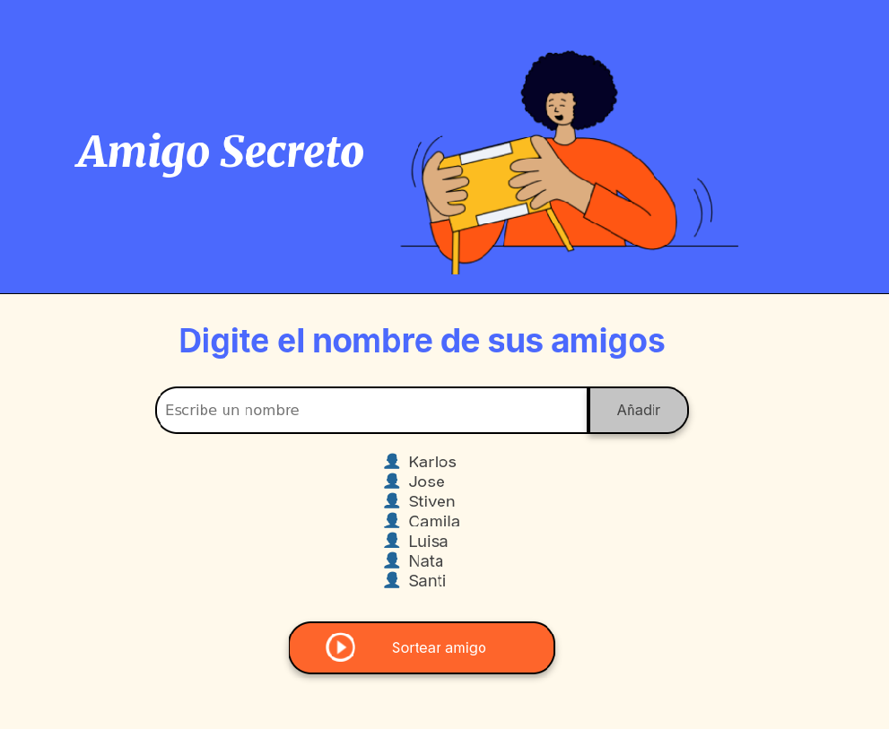
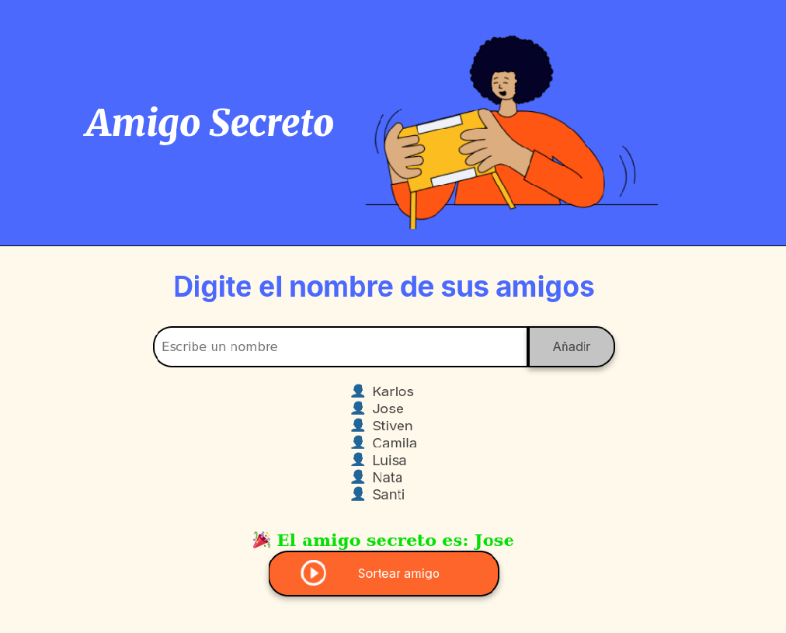

# 🎁 Proyecto Amigo Secreto

## 📖 Descripción
Aplicación sencilla para jugar al **Amigo Secreto**.  
Permite ingresar los nombres de los amigos en una lista y realizar un sorteo aleatorio para determinar quién será el amigo secreto.

## 🚀 Funcionalidades
- **Agregar nombres:** Los usuarios escriben un nombre y lo agregan con el botón **Adicionar**.
- **Validar entrada:** Si el campo está vacío, aparece una alerta indicando que se debe ingresar un nombre válido.
- **Visualizar lista:** Los nombres ingresados aparecen en una lista visible en pantalla.
- **Sorteo aleatorio:** Al hacer clic en el botón **Sortear Amigo**, se elige un nombre de forma aleatoria y se muestra en pantalla.

## 🛠️ Lenguajes utilizados
- HTML
- CSS
- JavaScript (Vanilla)

## 📋 Instructivo de uso
1. Escribe un nombre en el campo de texto.
2. Haz clic en el botón **Adicionar** para agregarlo a la lista.
3. Repite el paso anterior hasta ingresar todos los nombres.
4. Haz clic en el botón **Sortear Amigo** para conocer el resultado.

## 🖼️ Pantallazos
### Pantalla principal

### Lista de amigos agregados

### Resultado del sorteo

---
👨‍💻 Desarrollado para practicar lógica de programación en JavaScript.

